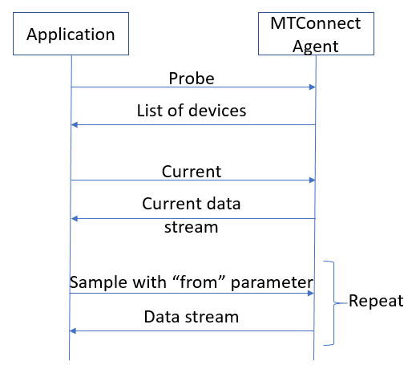

# Ingesting the NIST SMS Test Bed VDS Data

NIST publishes the manufacturing lab's volatile data stream (VDS) data at https://smstestbed.nist.gov/vds/. 

We will go through the  details of an implementation, describing how we are ingesting the data and turning into a stream.

VDS is implemented using MTConnect Standard. Details of the standard can be found at http://www.mtconnect.org. The standard offers a semantic vocabulary for manufacturing equipment. It defines a protocol to communicate with an **MTConnect Agent** and the schema for the data returned.

The agent exposes a REST endpoint that supports the following operations:
- **probe**: Returns the list of devices, components, subcomponents and data items
- **current**: Returns a snapshot of the data item's most recent values or the state of the device at a point in time
- **sample**: Returns Samples, Events and Condition in time series
- **asset**: Most recent state of an asset known to this device

An example of the protocol flow for this solution is like following:

We would like to oll the VDS endpoint, and once we receive the data stream, we want to post the data records on the data stream in name value pairs to an Azure Event Hub, so we can process the stream with a stream processing technology on the other end.

The ingest component needs to do the following tasks:
- Poll VDS
- Save raw result
- Transform the hieararchical XML result into a flat data records structure, with name-value pairs and time stamps
- Post to Azure Event Hubs

The options for implementing the "Ingest" component on Azure are plenty. We can list the following for implementing a polling component that can poll an HTTP end-point, save the raw data to an interim storage solution and post the transformed data to  Azure Event Hubs.
- Azure Logic Apps
- Custom code running on 
    - Azure Kubernetes Service, 
    - App Service, 
    - Container Instances, 
    - Virtual Machines, 
    - Service Fabric, 
    - Functions 

The implementation has two main parts,
- [Polling the VDS endpoint and saving the raw result](./poll/README.md)
- [Flattening the incoming data and posting to Azure Event Hubs](./flattenandpost/README.md)